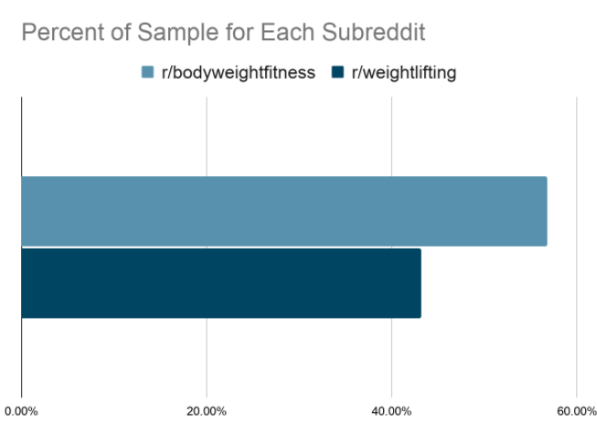
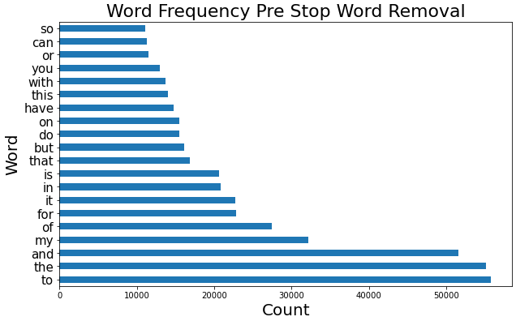

# Project 3: Web APIs & NLP

## Using NLP to Classify Reddit Posts: Bodyweight Fitness or Weightlifting

## Problem Statement

*Can we predict to what subreddit a post belongs?  Specifically, can we predict the categorization of r/bodyweightfitness and r/weightlifting postings?*

## Background and Executive Summary

This project employs data scraped from Reddit using the [*Pushshift API*](https://github.com/pushshift/api). Specifically, this project drew from two subreddits: r/bodyweightfitness and r/weightlifting. The goal was to build a statistical model to correctly predict the class of each post using user submitted text.  

### Data

The data for this project were scraped from the r/bodyweightfitness and r/weightlifting subreddits.  In total, 40,000 posts were scraped with 20,000 from each. The collection excluded all video posts and posts generated by an automoderator. 

#### Cleaning

During examination of the data, cleaning and restructuring was necessary for analyses. The first step taken was to remove any rows that had been flagged as deleted by a moderator, the original poster, or by Reddit. Further cleaning steps were taken which:   

- Removed duplicates
    - No duplicates were found, however, the step was still programmed in case it is necessary in the future.
- Keep only certain relevant columns
    - Columns kept for further processing include: 'selftext' or the text of the post and 'subreddit' or which subreddit the post was scraped from.
- Removed any additional unnecessary posts.
    - Upon further examination, posts that had been deleted by an 'AutoModerator' were removed as were those where 'is_self' was set to False.  The 'is_self'=False cases did not have an author and the content was flagged as deleted. 
    
After the additional cleaning noted above, 24,549 posts remain in the dataframe.  R/weightlifting accounted for 10,606 and r/bodyweightfitness accounted for 13,943 posts. This newly cleaned and pared down dataframe was exported as a csv for the next, analytic steps.

Lastly, r/weightlifting and r/bodyweightfitness were categorized with values of 0 and 1, respectively, in a dummy variable column called subreddit_bodyweightfitness.

Below is a graph outlining how much of the sample was drawn from r/bodyweightfitness (57 percent) and r/weightlifting (43 percent).

#### Exploratory Data Analyses

Prior to model building, high-level snapshots of the data were taken. This was done to inform understandings of the text and classes in the dataset. Also, and perhaps most importantly, it was conducted to observe any further cleaning needed.

Below is an image of the most frequent words before a stop words list was implemented.  Because of this, it was deemed necessary to remove these stop words as they did not appear to add to the following analyses.  After removal of custom stopwords - completed via a modified list curated from that found built into sklearn, most frequent words in the dataframe included things like workout, body, training, day, and weight.

#### Analyses

Several methods were employed to find a suitable model to see which was best suited to predict the classification of r/bodyweightfitness and r/weightlifting posts.  Multinomial Naïve Bayes, Logistic Regression, and Random Forest were all considered and tested.  Each model's parameters were adjusted over several iterations and each was modeled with TF-IDF or or Term Frequency Inverse Document Frequency - a word vectorization that finds how original a word is by comparing how often the word appears in a document or row with how many documents it appears in at all.  Each classification method was also modeled with the text vectorizer CVEC or Count Vectorizer.

Two models exhibiting the best accuracy with the least amount of overfitting were selected.  These models were Logistic Regression with default settings and Naive Bayes both using TF-IDF word vectorization.

Finally, some of the top words for each subreddit can be found below. While there is some overlap, the most common words for each subreddit are quite unique.

| r/bodyweightfitness | r/weightlifting |
|---------------------|-----------------|
| pull                | weightlifting   |
| workout             | squat           |
| push                | lifting         |
| body                | weight          |
| weight              | snatch          |
| exercises           | bar             |
| pull ups            | amp             |
| muscle              | gym             |
| routine             | clean           |
| training            | good            |

#### Results

A table of results is below. 

|   |Log Reg w/ TF-IDF   |Naïve Bayes w/  TF-IDF   |
|---|---|---|
|Cross Val   |0.900   |0.885   |
|Train Accuracy   |0.933   |0.897   |
|Test Accuracy   |0.902   |0.888   |
|Specificity   |0.854   |0.823   |
|Sensitivity   |0.940   |0.937   |
|Precision   |0.894   |0.874   |

The Logistic Regression model has a higher cross validation score and a higher training accuracy.  However, the difference between the train and test accuracy is larger than with the Naïve Bayes model.  The Naïve Bayes model has a cross validation score of 0.88, a train accuracy of 0.89 and a test accuracy of 0.88.

The accuracy is - overall - what percentage of observations were correctly predicted.  Specific to this study, this would be how well or accurately did the model predict posts as belonging to r/bodyweightfitness and r/weightlifting.

For the other metrics, the Logistic Regression also seems to have slightly superior specificity, sensitivity, and precision.

Both seemed to perform well with the sensitivity, though. Both models had a sensitivity of around 0.94 in terms of being able to correctly predict posts belonging to body weight fitness.

Specificity in this case, is how well the model correctly predicted those in the 0 or r/weightlifting class, the models were correct between 0.85 and 0.82 percent of the time.

## Data Dictionary

A condensed data dictionary is below. It is not possible to provide a complete list of all variables due to the way the submission text is vectorized.

|Feature|Type|Dataset|Description|
|---|---|---|---|
|subreddit_bodyweightfitness|int|cleaned_final.csv|Classification of subreddit 1=r/bodyweightfitness| 
|selftext|string|cleaned_final.csv|text of the reddit submission| 

## Conclusions

Both models predicted to which subreddit the post belonged to better than the baseline or null model which had a 57% accuracy. These models performed similarly although most of the metrics for the Logistic Regression appeared to edge out the Naïve Bayes.  The exception here would be the train and test accuracy.  The Logistic Regression seemed to be slightly more overfit than the Naïve Bayes.

Lastly, there are interesting differences in the top words found in each subreddit.  Perhaps not so surprising to interested parties but the lists shown earlier have some obvious differences.

## Recommendations

* Build more models and tinker more with the parameters for each of these models.

* Refine the stop words list.

* Collect more data.  
    * Perhaps diversify the date range or maybe look at posts before a certain date.

* Examine post titles.  
    * The selftext for each subreddit was different, maybe the titles are, too.

* Look at other fitness subreddits.  
    * r/running and r/jogging

# Sources
* https://github.com/pushshift/api
* https://www.reddit.com/r/weightlifting/
* https://www.reddit.com/r/bodyweightfitness/